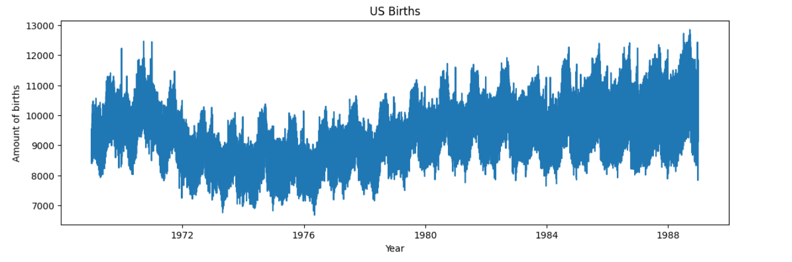
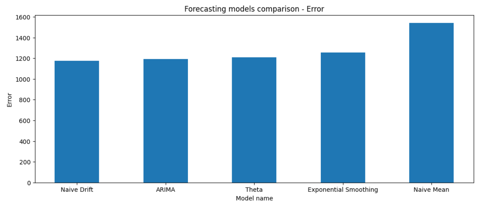

# time-series-forecasting
A time series forecasting project developed for a MEISSA Project (LIAD/UFCG) training that uses the US Births dataset, a long daily time series representing the number of births in the United States from 1969 to 1988.

**DESCRIPTION**

This repository contains a time series forecasting project developed as part of a MEISSA Project (LIAD/UFCG) training. The dataset used is the US Births dataset, a long daily time series representing the number of births in the United States from January 1, 1969, to December 31, 1988. The project compares five different forecasters (Naive Drift, Naive Mean, Theta, ARIMA, Exponential Smoothing) performances while predicting future values based on historical data.

Below is a graph illustrating the time series.

Below is a graph comparing the errors observed on each forecasting model's results, according to the RMSE metric.

**HOW TO RUN**

1. Click on "Open In Colab"
2. Run all cells

**AUTHOR**
Anne Grazieli Marques Silva, Computer Science student at UFCG
